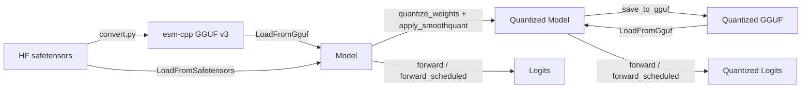
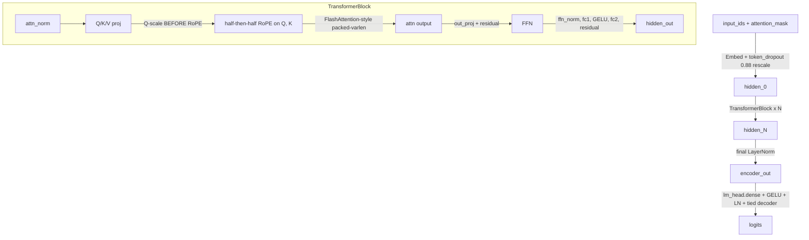
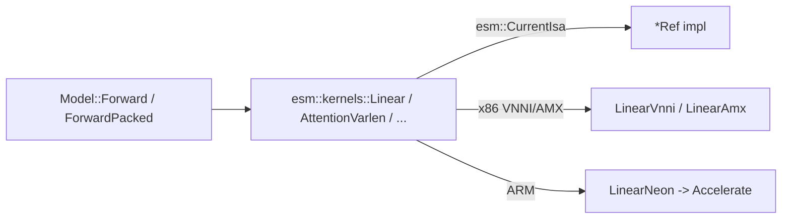

# Architecture

esm.cpp is a CPU-first C++ inference engine for [ESM-2](https://github.com/facebookresearch/esm) protein language models, distributed as a `pip install`-able Python package. The defensible niche is the intersection no existing project occupies: production-grade CPU inference + ahead-of-time W8A8 quantization + variable-length packed-batch scheduling for encoder-only PLMs.

## System overview



The public surface is the Python `Model` class:

```python
import esm_cpp
m = esm_cpp.Model.load_from_gguf("weights/esm2_650m_q8.gguf")
logits = m.forward(tokenizer.encode(seq))                     # B=1
logits = m.forward_scheduled([ids_0, ids_1, ids_2, ...])      # packed-batch
```

## Forward path



Three load-bearing quirks from the ESM-2 reference (mistakes here produce silent quality drift, not crashes):

1. **half-then-half RoPE.** ESM-2 uses Llama/GPT-NeoX rotate-half ordering, NOT RoFormer/GPT-J interleaved. See [src/kernels/rope.cpp](../src/kernels/rope.cpp).
2. **token_dropout 0.88 rescale at inference.** ESM rescales all embeddings by `(1 - 0.12) / (1 - mask_ratio)`. When the mask ratio is zero, this is 0.88 — every inference pass scales the embedding output by 0.88. See [src/model.cpp](../src/model.cpp).
3. **Q-scale before RoPE.** Q is scaled by `1 / sqrt(head_dim)` *before* RoPE is applied. ESM is bit-equivalent only with this order — RoPE is norm-preserving in exact arithmetic but not in finite precision.

## Kernel dispatch



`esm::CurrentIsa()` returns:
- the host-detected ISA (`HostIsa()`), or
- the `ESM_FORCE_ISA` env var if set (used by CI to test each path).

The dispatch facade is in [src/kernels/dispatch.cpp](../src/kernels/dispatch.cpp). Per-ISA bodies live behind `#ifdef ESM_KERNEL_*` blocks in the same `gemm_*.cpp` files — the same .cpp file compiles 1-2 times into different per-ISA OBJECT libraries with different `-march=...` and `ESM_KERNEL_*` flags.

## Packed cu_seqlens scheduler

For variable-length batches, the encoder runs once on a single concatenated `[T, d]` tensor where `T = sum(L_b)`; per-sequence isolation is enforced inside `AttentionVarlen` via `cu_seqlens`. The scheduler ([include/esm_cpp/scheduler.h](../include/esm_cpp/scheduler.h)) plans groups of input sequences:

- Chunk into batches of `max_batch_size` in caller order.
- If `max(L) / mean(L) > imbalance_threshold` (default 1.2), sort by length and split into two halves.
- Otherwise pack as a single cu_seqlens forward.

The synchronous `Model::ForwardScheduled(list_ids) -> list_logits` API is what PPPL / ProteinGym / `bench.compare` use. A streaming submit/future API is v1.1.

## Quantization

See [quant-recipe.md](quant-recipe.md). The short version:

- **Weights:** per-channel symmetric INT8, range `[-127, 127]` (no zero-point).
- **Activations (W8A8 path):** per-tensor symmetric INT8 with zero-point 128 (`u8 in [1, 255]`).
- **SmoothQuant offline migration:** α=0.5 default, computed from a 99.9-pctile observer on UniRef50 calibration data. Identity-preserving for FP32 forward.
- **Escapes:** `lm_head.dense` + `lm_head.layer_norm` + tied decoder stay FP32; layer-0 fc1 input optionally rounded to FP16 if the SmoothQuant + INT8 PPPL drift exceeds 0.2.

## Repository layout

```
esm-cpp/
├── include/esm_cpp/          # Public C++ headers (stable API)
├── src/                       # C++ implementation
│   ├── model.cpp              # Forward graph + load + quantize entry points
│   ├── kernels/               # Per-ISA SIMD kernels + dispatch facade
│   ├── quant/                 # Observer + SmoothQuant + INT8 weight pack
│   ├── io/                    # GGUF + safetensors readers/writers
│   └── sched/                 # cu_seqlens scheduler
├── python/esm_cpp/            # pybind11 bindings + Python entry points
│   ├── convert.py             # HF -> GGUF converter (esm-cpp-convert)
│   ├── quantize.py            # calibration + quantization (esm-cpp-quantize)
│   ├── eval/pppl.py           # exact PPPL (esm-cpp-pppl)
│   ├── eval/proteingym.py     # ProteinGym Spearman
│   └── bench/compare.py       # public benchmark (esm-cpp-bench)
├── tests/cpp                  # GoogleTest kernel + workspace + tokenizer
├── tests/python               # pytest end-to-end vs HF + GGUF round-trip
├── tests/golden               # captured HF hidden states (8M, 35M)
├── bench/                     # Google Benchmark microbenchmarks
├── tools/                     # convert / fetch / render scripts
├── docs/                      # this file + benchmarks + quant-recipe
└── notes/                     # phase retrospectives
```
